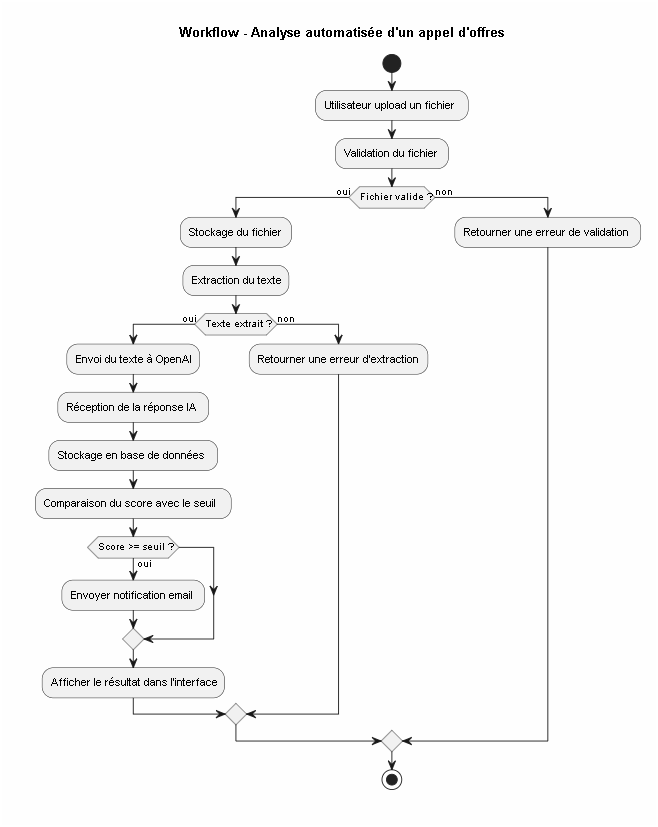

# 02 — Architecture

## Diagramme de flux principal

## Pipeline de traitement

1. Upload du fichier (PDF, DOCX, TXT)
2. Validation et stockage du fichier
3. Extraction du texte brut
4. Envoi à l'API OpenAI avec le profil d'intérêt
5. Réception : score (0-100), résumé, compétences, domaine
6. Stockage en base de données (PostgreSQL)
7. Si score ≥ seuil → notification email automatique
8. Affichage dans l'interface web

## Logique de scoring

| Score | Décision | Action |
|---|---|---|
| ≥ 75 | Très pertinent | Notification email + tête de liste |
| 50–74 | Pertinent | Affiché dans la liste |
| < 50 | Non pertinent | Archivé |

## Schéma base de données

| Table | Description |
|---|---|
| `appels_offres` | id, titre, domaine, fichier_path, score, resume, statut, date_analyse |
| `competences_extraites` | id, ao_id, competence |
| `profils_interet` | id, nom_profil, domaines, competences, budget_min, seuil_alerte |
| `notifications` | id, ao_id, user_id, type, envoyee_le |
