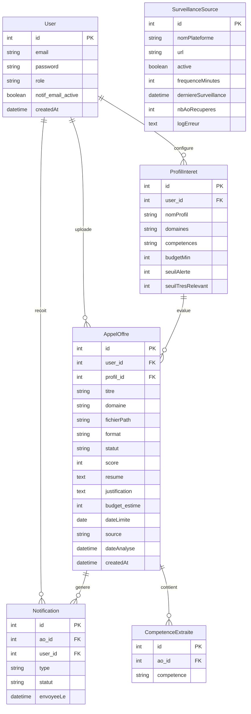

# MCD — Modèle Conceptuel de Données
## Projet : Analyse et filtrage automatisés des appels d'offres par IA
**Entreprise :** Trybe (SARL AIVOT)

---

---

## Relations

| Relation | Type | Description |
|----------|------|-------------|
| User → AppelOffre | 1,N | Un utilisateur peut uploader plusieurs AO |
| User → ProfilInteret | 1,N | Un utilisateur configure plusieurs profils |
| User → Notification | 1,N | Un utilisateur reçoit plusieurs notifications |
| ProfilInteret → AppelOffre | 1,N | Un profil évalue plusieurs AO |
| AppelOffre → CompetenceExtraite | 1,N | Un AO contient plusieurs compétences extraites |
| AppelOffre → Notification | 1,N | Un AO génère plusieurs notifications |

---

## Logique de scoring

| Score | Décision | Action |
|-------|----------|--------|
| ≥ 75 | Très pertinent | Notification email + tête de liste |
| 50–74 | Pertinent | Affiché sans notification |
| < 50 | Non pertinent | Archivé |
